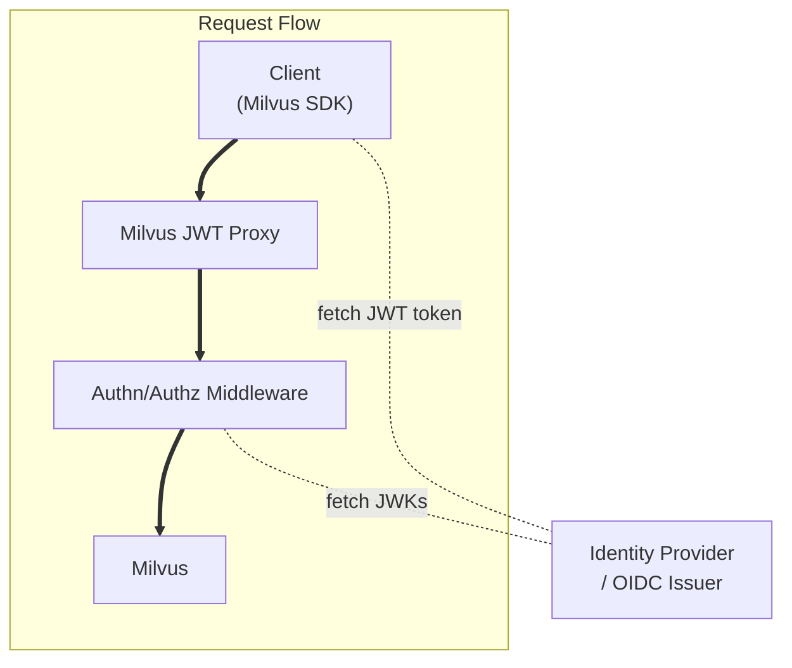

# Milvus JWT Proxy

Milvus JWT Proxy is a lightweight reverse proxy that normalizes and forwards client requests to Milvus while enabling integration with standard JWT-based authentication and authorization middleware.

Milvus JWT Proxy performs a minimal, well-defined set of transformations so that Milvus can be deployed behind modern enterprise identity infrastructures (OIDC, OAuth2, JWT-based RBAC) without modifying client SDKs or Milvus itself.

## Overview

Milvus JWT Proxy listens for client requests, optionally rewrites the `Authorization` header into a standard `Bearer <JWT>` token, and proxies the request to the configured upstream Milvus endpoint. It is deliberately minimal: Milvus JWT Proxy's role is header normalization and transparent proxying — it is not an identity provider or a full JWT validation service.

Recommended deployment pattern:



In this pattern Milvus JWT Proxy normalizes incoming headers and the downstream middleware performs JWT validation and RBAC enforcement.

## Why use Milvus JWT Proxy

Enterprise environments commonly require a centralized, auditable authentication and authorization control plane (such as Istio, an API gateway, or a service mesh RBAC layer). Milvus JWT Proxy's role is header normalization and transparent proxying — it is not an identity provider or a full JWT validation service.

By placing Milvus JWT Proxy at the network boundary and delegating actual token validation and RBAC decisions to a downstream middleware that understands standard JWT and OIDC patterns, you get several benefits:

- Compatibility with enterprise identity providers (OIDC / OAuth2) and centralized JWKS/JWKS caching
- Consistent, organization-wide RBAC enforced by a single control plane (service mesh or gateway) rather than ad-hoc database-level auth
- Ability to continue using Milvus official SDKs unchanged, because Milvus JWT Proxy preserves request semantics while ensuring the Authorization header is in a standard form
- Simpler operational model: Milvus JWT Proxy is a small binary to deploy, while complex policy, auditing, and rotation concerns remain handled by your existing middleware

## Key Capabilities

- Transparent proxying to an upstream Milvus-compatible HTTP endpoint
- Authorization header normalization:
  - Passes through `Authorization: Bearer <token>` unchanged
  - If the header value is a base64-encoded string that decodes to `x-jwt-token:${JWT}`, Milvus JWT Proxy rewrites the header to `Authorization: Bearer ${JWT}`
- Mirrors incoming client protocol when creating the upstream client connection (supports HTTP/1.1, HTTP/2 and gRPC)
- Small, container-friendly binary suited for Kubernetes and service-mesh deployments

## Configuration

Milvus JWT Proxy reads configuration from environment variables:

- `PROXY_LISTEN_ADDR` — address to bind to (default: `0.0.0.0:8000`)
- `UPSTREAM_URL` — upstream Milvus HTTP URL (default: `http://localhost:19530`)

Example environment configuration:

```bash
PROXY_LISTEN_ADDR=0.0.0.0:8000
UPSTREAM_URL=http://milvus-with-auth:19530
```

## Security model and responsibilities

- Milvus JWT Proxy is responsible for header normalization and request forwarding. It does not perform JWT signature validation, issuer/audience checks, or policy evaluation in the current implementation.
- JWT validation and RBAC enforcement should be performed by a dedicated middleware placed downstream of Milvus JWT Proxy. Examples:
  - Istio: `RequestAuthentication` to validate JWTs and `AuthorizationPolicy` (or Envoy RBAC) to enforce policies
  - API gateways or ingress controllers that support JWT validation and RBAC
- This separation of concerns keeps Milvus JWT Proxy small and reliable while letting established, production-grade systems manage authentication lifecycle, key rotation, policy audit, and logging.

## Deployment notes

- Deploy Milvus JWT Proxy as close to your edge or ingress as appropriate for your topology. In Kubernetes, Milvus JWT Proxy can run as a sidecar or as a standalone Deployment in front of the Milvus Service and the authentication middleware.
- Ensure your downstream middleware (service mesh, gateway) is configured to accept and validate the `Authorization: Bearer <JWT>` header that Milvus JWT Proxy forwards.

## Non-Goals

- Milvus JWT Proxy does not act as an identity provider or OIDC client
- Milvus JWT Proxy does not validate JWT signatures or fetch JWKS
- Milvus JWT Proxy does not implement fine-grained, data-level authorization such as collection-level ACLs

## Development and testing

Unit tests cover the header transformation behavior. See `src/auth.rs` for the transformation logic and tests.

## License

This project is licensed under the Apache License, Version 2.0. See the `LICENSE` file for details.
